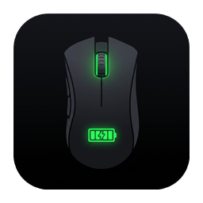
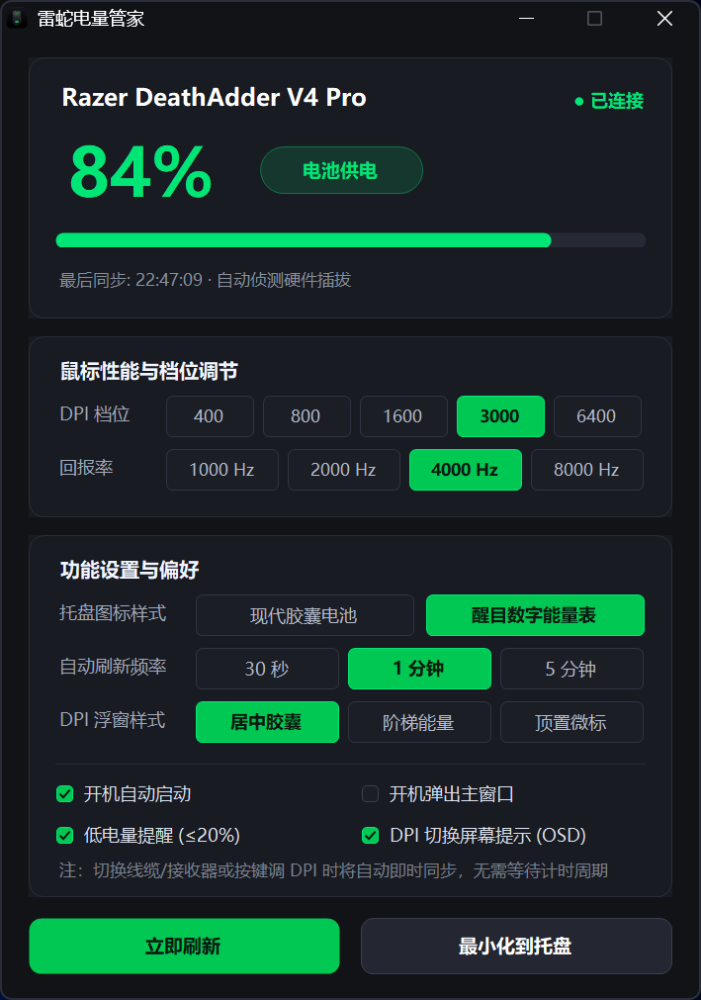
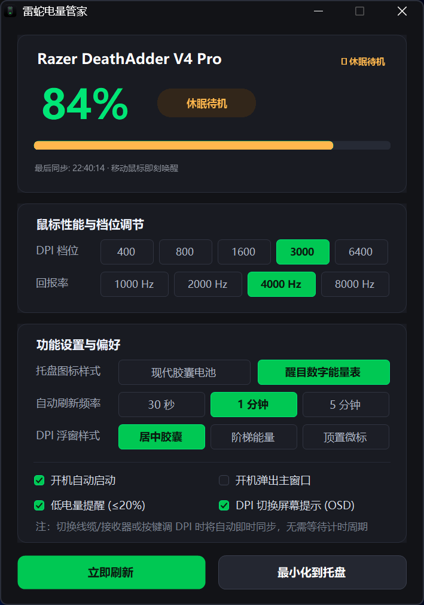
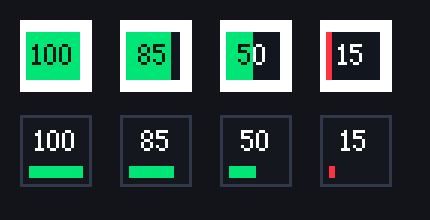

# 🐍 雷蛇电量管家 (Razer Battery Tray) v2.0 Pro

<p align="center">
  
</p>

<p align="center">
  <b>专为雷蛇无线鼠标深度打造的高颜值、极轻量 Windows 任务栏电量与硬件管理工具</b>
</p>

<p align="center">
  
  
  
  
</p>

---

## 💡 为什么需要它？

官方 **Razer Synapse (雷云 3/4)** 驱动全家桶常驻 8~10 个后台进程，长期吞噬 **500MB+** 物理内存与 CPU 资源，开机变慢，且鼠标静置休眠后经常误报 0% 电量。

**雷蛇电量管家** 彻底颠覆这一切：
* ⚡ **极速轻量**：仅约 **15MB** 常驻内存，0.1秒秒速冷启，单文件绿色免安装，CPU 占用长期 **0.00%**。
* 🎨 **Windows 11 原生美学**：深度契合 Win11 暗黑圆角、Mica 拟态半透明质感，像素级对齐。
* 🔋 **独家智能休眠待机算法**：区分「物理拔出断联」与「静置休眠待机」，休眠时显示高雅琥珀金待机状态并记忆电量，拿起鼠标瞬间毫秒级刷新。
* 🎮 **全屏游戏无感 OSD**：Win32 底层零焦点悬浮 (`SWP_NOACTIVATE`) 与鼠标 100% 物理穿透 (`WS_EX_TRANSPARENT`)，调节 DPI 顺滑浮现，无边框全屏游戏绝不切回桌面、绝不吞枪！
* 🔘 **三大原生托盘风格**：居中拟态胶囊（推荐）、紧凑微型徽标、极简状态指示，随心一键切换。

---

## 📸 界面预览

| 🌞 正常工作模式 (84% 能量充沛) | 🌙 智能休眠待机模式 (独家算法记忆) |
| :---: | :---: |
|  |  |

### 任务栏三大原生风格展示


---

## 🚀 核心功能特性

1. **硬件直接通信 (HID API)**：
   - 绕过所有第三方驱动框架，使用 Windows 原生 `hid.dll` 直接读写雷蛇鼠标特征报告，**无需管理员权限 (无 UAC 弹窗)**。
2. **DPI 与轮询率实时调谐**：
   - 支持在主面板上一键切换鼠标 DPI（400 / 800 / 1600 / 3000 / 6400）与回报率（1000Hz / 2000Hz / 4000Hz / 8000Hz）。
3. **电竞级防打扰设计**：
   - 在支持无边框全屏 (Borderless) 的游戏中，悬浮 OSD 不会向系统请求焦点，彻底解决第三方工具抢焦点导致游戏最小化切回桌面的致命痛点。
4. **纯净绿色与隐私安全**：
   - 零网络连接、零数据遥测、零弹窗广告，开机自启通过标准注册表 Run 项无感驻留。

---

## 🛠️ 本地编译构建

本项目采用纯 C# 单文件编写，使用 Windows 系统自带的 .NET Framework 编译器，**无需安装 Visual Studio 等庞大 IDE** 即可直接秒级编译：

```cmd
# 克隆仓库
git clone https://github.com/<your-username>/RazerBatteryTray.git
cd RazerBatteryTray

# 运行一键构建脚本
build.bat
```

构建完成后将在当前目录生成独立的 `RazerBatteryTray.exe`。

---

## 📦 下载与运行

* **便携版下载**：访问 [Releases 页面](../../releases) 下载最新版的 `雷蛇电量管家_v2.0_绿色版.zip`。
* **运行方式**：解压后双击 `RazerBatteryTray.exe` 即可运行。
* **初次运行提示**：因个人开源作品未购买商业数字证书，若弹出 Windows SmartScreen 提示，点击 **「更多信息」 -> 「仍要运行」** 即可。

---

## 📄 开源许可证

本项目基于 [MIT License](LICENSE) 协议开源。
